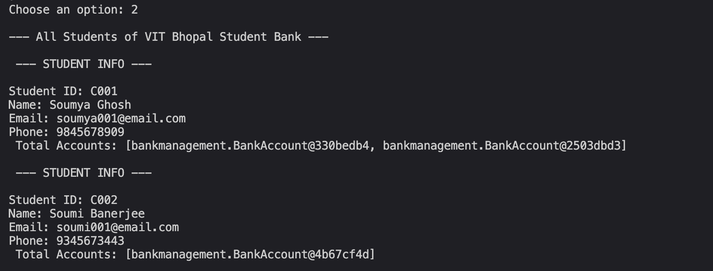
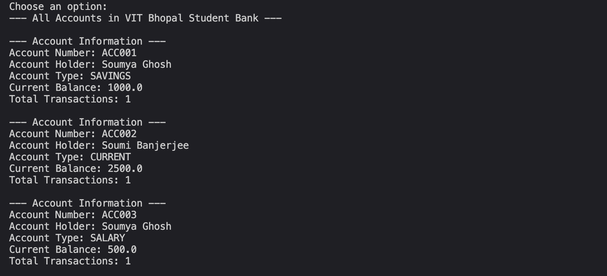
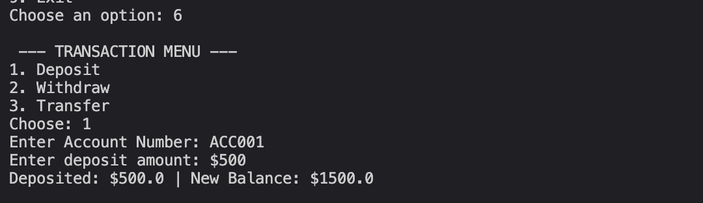
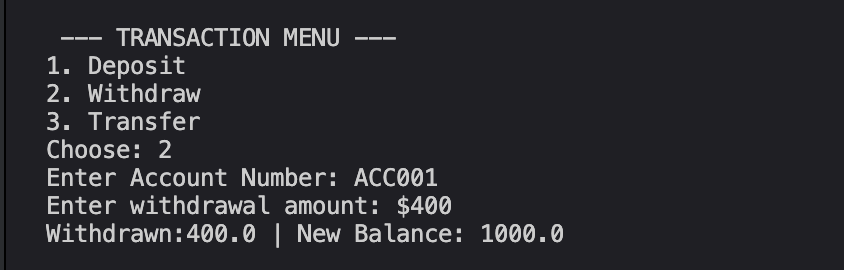
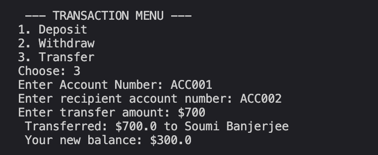
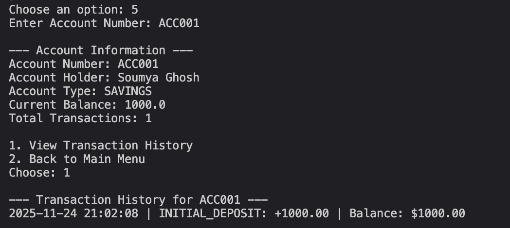
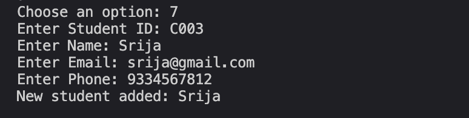
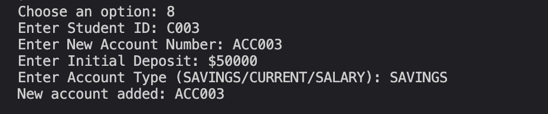
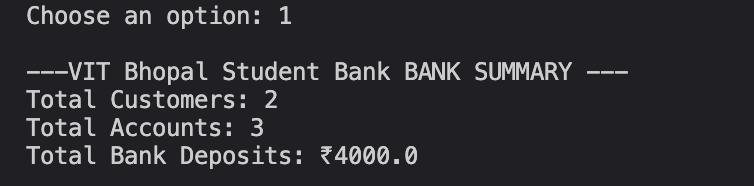

cat > /Users/soumyaghosh/Academics/interimsem/java/programs/vityarthi/bankmanagement/README.md << 'EOFREADME'
# VIT Bhopal Student Bank Management System

## Project Title
**VIT Bhopal Student Bank Management System**

A java console based project that is made for smooth banking management for VIT Bhopal Students. This project lets student create new account, all the transaction related features such as deposit, withdrawal of money are included.

---

## Overview of the Project

This project lets VIT Bhopal students smoothly manage thier banking needs through a console based system. This program is made cosidering the banking management issue for students. So this program uses the core OOPs features of Java and use them efficiently to make a robust, maintainable, extensible, flexible system for management of banking needs for students in VIT Bhopal University. The features include Client side features like options for transactions, opening new account, seeig banking summary and does include server side features like viewing all accounts, students adding new students under the platform.

---

## Features

### Core Banking Features
- **Student Account Management**
  - New students can regsiter throught their unique ID.
  - Storing personal information of students like name, Id, email, Phone no.
  - Create multiple differnt type accounts per student.

- **Account Operations**
  - SAVINGS account type
  - CURRENT account type
  - View detailed account information

- **Financial Transactions**
  - **Deposits**: Add funds to any students account 
  - **Withdrawals**: Withdraw funds with balance validation
  - **Transfers**: Transfer money between multiple students acc
  - balance gets automatically updated after each succesfull transaction

- **Transaction Management**
  - Track complete transaction history
  - Can fetch timestamp for each and every transaction
  - Transaction ID generation for reference purpose
  - Balance-after information for after each transaction

- **Bank Summary**
  - View the total no. of STudents logged
  - View total number of accounts 
  - Monitor total bank deposits in rupees (₹)

- **Student Information**
  - Display all registered students under the system
  - View details that are specific to students logged
  - Can track any students account

---

## Technologies/Tools Used

### Programming Language
- **Java 11+** - Core language for the dev of the applicatoin

### Libraries & Frameworks
- **java.util.ArrayList** -Dynamic list management
- **java.util.List** - Collection interface
- **java.time.LocalDateTime** - Tracking of timestamp
- **java.time.format.DateTimeFormatter** - Formatting of dates
- **java.util.Scanner** - Handling User inputs

### Version Control
- **Git** - Source code management
- **GitHub** - Remote repository hosting

### IDE/Editor
- **Visual Studio Code** - Code editor (recommended)
- **Java Development Kit (JDK)** - Java compiler and runtime

---

## Steps to Install & Run the Project

### Prerequisites
- Java Development Kit (JDK 11 or higher) installed on your system
- Git installed for cloning the repository
- Terminal/Command Prompt access

### Installation Steps

1. **Clone the entirer Repository**
   ```bash
   git clone https://github.com/soumyaGhoshh/vityarthi-java-project.git
   cd vityarthi-java-project
   ```

2. **Navigate to the Project Directory in local**
   ```bash
   cd vityarthi/bankmanagement
   ```

3. **Compile the Java Files by javac command**
   ```bash
   javac *.java
   ```
   Or compile all Java files in the package:
   ```bash
   javac bankmanagement/*.java
   ```

### Running the Application

From the `bankmanagement` directory, run:
```bash
java BankApp
```
Or, if running from the parent `vityarthi` directory:
```bash
java -cp . bankmanagement.BankApp
```

### Sample Execution Output
```
Welcome to VIT Bhopal Student Bank Management System!

=== MAIN MENU ===
1. View Bank Summary
2. View All Students
3. View All Accounts
4. Student Operations
5. Account Operations
6. Transactions
7. Add New Student
8. Open New Account
9. Exit

Choose an option:
```

---

## Instructions for Testing

### Test Case 1: View All Students
1. Run the application once
2. Select option `2` (Viewing All Students)
3. Verify that pre-loaded student information is displayed
4. Expected Output: Display of all registered students with their details
 
 **Screenshot (example):**


### Test Case 2: View All Accounts
1. Run the application
2. Select option `3` (View All Accounts)
3. Verify that all accounts are listed with account numbers, holders, types, and balances
4. Expected Output: Complete account listing with account information

**Screenshot (example):**


### Test Case 3: Deposit Money
1. Run the application
2. Select the option `6` (Transactions)
3. Select the sub-option `1` (Deposit)
4. Enter an existing account number (e.g., `ACC001`)
5. Enter a deposit amount (e.g., `500`)
6. Expected Output: Success message with new balance

**Screenshot (example):**


### Test Case 4: Withdraw Money
1. Run the application
2. Select option `6`(Transactions)
3. Select sub-option `2` (Withdraw)
4. Enter an existing account number (e.g.,`ACC001`)
5. Enter a withdrawal amount (less than current balance)
6. Expected Output: Success message with updated balance

**Screenshot (example):**


### Test Case 5: Transfer Between Accounts
1. Run the application
2. Select option `6` (Transactions)
3. Select sub-option `3` (Transfer)
4. Enter source account number (e.g., `ACC001`)
5. Enter recipient account number (e.g., `ACC002`)
6. Enter transfer amount
7. Expected Output: Success message with both accounts updated

**Screenshot (example):**


### Test Case 6: View Transaction History
1. Run the application
2. Select option `5` (Account Operations)
3. Enter account number (e.g., `ACC001`)
4. Select sub-option `1` (View Transaction History)
5. Expected Output: Complete transaction history with timestamps

**Screenshot (example):**


### Test Case 7: Add New Student
1. Run the application
2. Select option `7` (Add New Student)
3. Enter student ID, name, email, and phone number
4. Expected Output: Success confirmation message

**Screenshot (example):**


### Test Case 8: Open New Account
1. Run the application
2. Select option `8` (Open New Account)
3. Enter existing student ID
4. Enter new account number
5. Enter initial deposit amount
6. Select account type (SAVINGS/CURRENT/SALARY)
7. Expected Output: Account creation confirmation

**Screenshot (example):**


### Test Case 9: View Bank Summary
1. Run the application
2. Select option `1` (View Bank Summary)
3. Verify total students, accounts, and deposits are displayed
4. Expected Output: Summary statistics

**Screenshot (example):**


### Test Case 10: Exit Application
1. Run the application
2. Select option `9` (Exit)
3. Expected Output: Farewell message and application closure

**Screenshot (example):**


---

## Project Structure

```
bankmanagement/
├── Bank.java              # Bank management class
├── BankAccount.java       # Account operations class
├── BankApp.java           # Main application entry point
├── Customer.java          # Student/Customer information class
├── Transaction.java       # Transaction details class
├── .gitignore             # Git ignore configuration
└── README.md              # Project documentation
```

---

## Error Handling

The application includes validation for:
- Invalid menu options
- Insufficient funds for withdrawals
- Non-existent student/account IDs
- Invalid transaction amounts
- Empty account lists

---

## Future Enhancements

- Database integration (MySQL/PostgreSQL)
- User authentication and login system
- Advanced reporting and analytics
- Export transaction history to CSV/PDF
- Interest calculation for savings accounts
- Loan management system
- Mobile application interface

---

## Author

**Soumya Ghosh**  
VIT Bhopal University  
GitHub: [@soumyaGhoshh](https://github.com/soumyaGhoshh)

---

## License

This project is open-source and available for educational purposes.

---

## Contact & Support

For questions or issues, please open an issue on the GitHub repository:
[https://github.com/soumyaGhoshh/vityarthi-java-project/issues](https://github.com/soumyaGhoshh/vityarthi-java-project/issues)

---

## Changelog

### Version 1.0(Current version )
- Initial release
- The core banking features implemented in there
- The transaction management system
- The Student account management
- The Complete transaction history tracking
---
**Last Updated**: November 24, 2025
EOFREADME